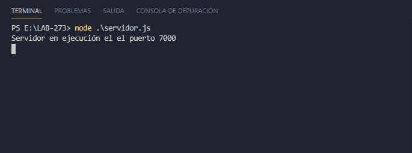
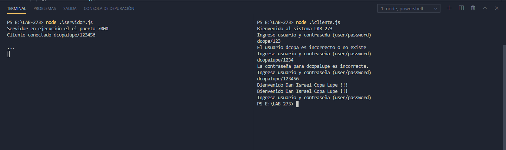
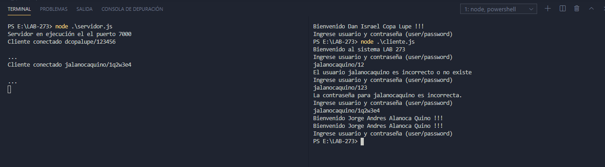

# Simulación de inicio de sesión

Crear un programa cliente, servidor de forma que simule el inicio de sesión de un sistema de información. El cliente debe recibir un mensaje cuando se conecte con el servidor pidiendo las credenciales del usuario y contraseña, por cada envió de los datos se debe desplegar un mensaje en caso de: el usuario este incorrecto o no exista, la contraseña sea incorrecta y por ultimo si el usuario envió los datos correctamente. Finalmente, si el usuario es correcto debe desplegarse el mensaje de bienvenida y la conexión debe terminar, caso contrario debe pedirse de nuevo las credenciales.

## Usuarios

| ID | NOMBRE       | APELLIDO       | USUARIO        | PASSWORD |
|----|--------------|----------------|----------------|----------|
| 1  | Dan israel   | Copa Lupe      | dcopalupe      | 123456   |
| 2  | Jorge Andres | Alanoca Quino  | jalanocaquino  | 1q2w3e4  |
| 3  | Ana          | Condori Quispe | acondoriquispe | 54321    |

## Ejecución

Ejecución del servidor
```
node servidor.js
```

Ejecución del cliente

```
node cliente.js
```

## capturas de pantalla de la ejecución

1. Ejecución del servidor



2. realizamos las pruebas con un usuario, para los 3 casos

* No encontrar el usuario
* No concidencia de la contraseña
* Y verificación correcta de usuario y contraseña



3. Para ver que el servidor sigue corriendo hacemos la prueba con un usuario más


